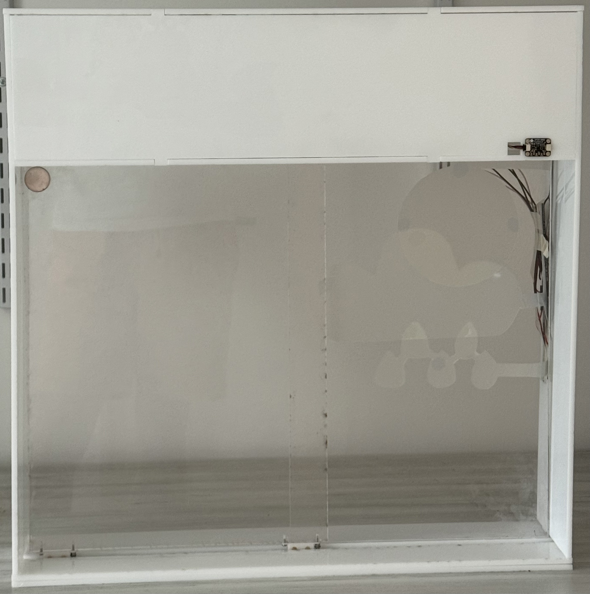
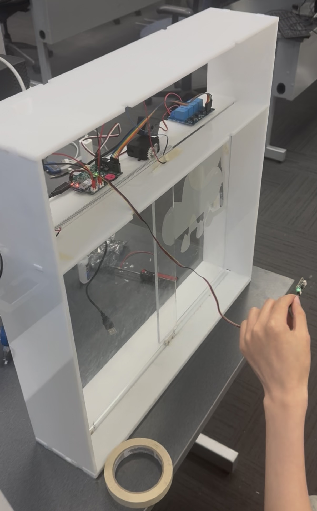
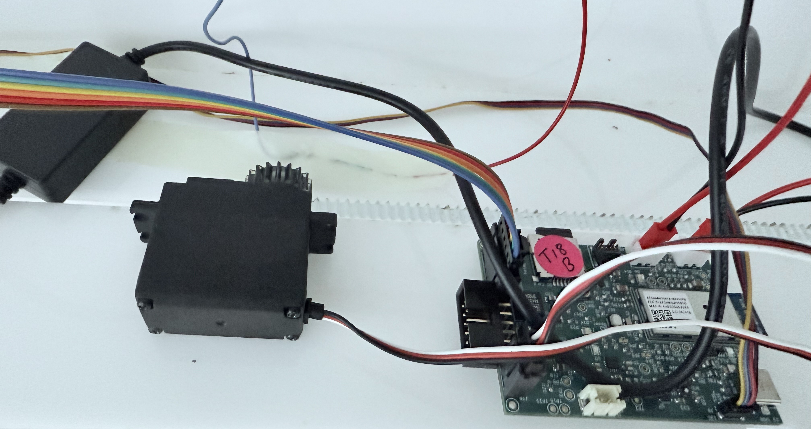
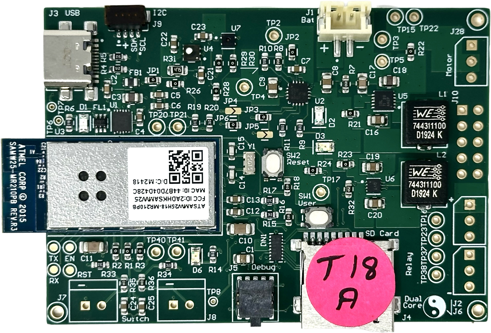
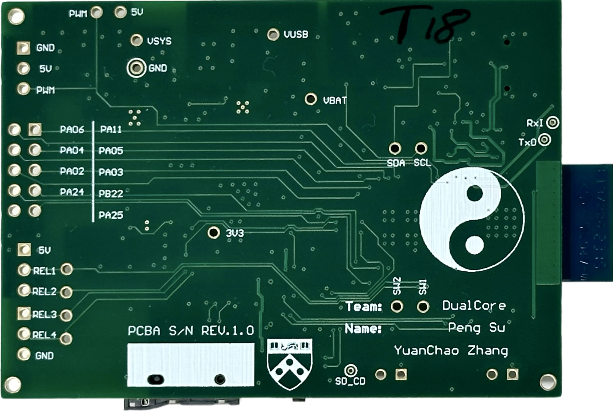

# a14g-final-submission

    * Team Number: 18
    * Team Name: DualCore
    * Team Members: Peng Su, Yuanchao Zhang
    * Github Repository URL: https://github.com/ese5160/a14g-final-submission-s25-t18-dualcore
    * Description of test hardware: (1) Apple M3 Pro, macOS Sonoma (2) Apple M1 Pro - MacBook (development boards, sensors, actuators, laptop + OS, etc) 

## 1. Video Presentation

## 2. Project Summary

### Device Description

This smart window system integrates three user settings: gesture-based physical control (customized), autonomous environmental response (automatic), and remote management via Node-RED UI. Real-time outdoor weather data retrieved from a public API is displayed through PDLC film directly attached to the window. The system reacts dynamically to changes in indoor temperature, humidity, and air quality and simultaneously transfers this indoor data to Node-RED for remote monitoring.

- **Inspiration & Problem Solution:**

In an era of smart devices and automation, why haven’t our windows learned to take care of themselves? This project began with that simple yet overlooked question, reflecting the frustration of users who are either too busy or too far away to manually manage their windows. While many smart home solutions focus on lighting or HVAC, intelligent window systems remain relatively rare. Our system addresses this gap by combining gesture control, automated environmental response, and remote access via Node-RED—empowering users to maintain a comfortable and safe indoor environment whether they're home, at work, or asleep.

- **Internet-Augmented functionality:**

To enhance its intelligence and connectivity, our system uses the Internet in two main ways: it pulls real-time outdoor weather data from a public API to be shown on the PDLC film, and it uploads live indoor environmental data to the Node-RED dashboard, enabling users to remotely monitor and control their environment in real time. Additionally, the Node-RED interface provides four remote UI buttons that allow users to open or close the window, stop the current motion, or resume the previous control status, ensuring the window continues from where it left off before the stop command.

### Device Functionality

Our Internet-connected smart window system integrates sensors, actuators, and mechanical elements to achieve IoT functionality:

- **Sensors (all I²C-based):**

SHTC3: Temperature and humidity sensor. It provides real-time environmental data used to determine whether the window should be opened or closed automatically and also updates the Node-RED dashboard for remote user awareness.

SGP40: VOC (air quality) sensor. When indoor air quality drops (e.g., smoke or poor ventilation), this sensor triggers the system to open the window for immediate ventilation.

APDS-9960: Gesture sensor for physical user input. It allows the user to switch between control modes or manually operate the window without needing a mobile interface.

Switch Reed: Magnetic contact sensor used to detect when the window is fully closed and signals the servo to stop rotation, ensuring precise and safe positioning.

- **Actuators:**

FS5103R Continuous Rotation Servo: Controls window movement using continuous 360-degree rotation. It operates based on pulse width modulation (PWM), allowing clockwise rotation (700–1500 µs), counter-clockwise rotation (1500–2300 µs), and stops at the neutral 1500 µs signal. This flexibility enables precise directional control for opening and closing the window.

4-Channel Relay Module: Switches high-voltage PDLC segments.

PDLC Film: Acts as both a visual output and a controllable display surface.

- **Other Critical Components:**

Moving Wheel Assembly: Facilitates smooth and stable horizontal sliding of the window, reducing friction and supporting accurate movement during actuation.

Customized Servo Gear: Mechanically interlocks with a linear gear strip mounted along the top edge of the window, converting the servo’s rotational motion into linear sliding motion for precise control.

### Challenges & Solutions

One of the most memorable challenges we faced was designing a **flexible and intelligent way for users to control the window’s opening and closing.** While we initially implemented four Node-RED UI buttons for remote operation, we quickly discovered limitations, both in real-world edge cases and during testing. For instance, when the **Internet connection is lost,** users cannot rely on the UI, leaving manual hand-movement as the only fallback, which compromises the system’s intelligence. Even when the network connection is stable, we observed that our **multiple WiFi Tasks could become unresponsive or slow to react,** especially when handling transitions between **different servo operations** that depend on carefully tuned PWM signals. These delays occasionally prevented timely command execution from the Node-RED interface, resulting in **inconsistent control.** Moreover, relying solely on button presses **lacked novelty** and didn’t align with the intuitive, physical habit of sliding windows by hand, prompting us to **explore a more natural, responsive solution:**

To overcome this, **Peng Su** proposed a pivotal enhancement: integrating the **APDS-9960 gesture sensor** into our final design. This was not part of our original plan, but it turned out to be a **game-changing addition:** With carefully developed firmware, we enabled **intuitive left and right-hand gestures to control window movement in real time.** This solution not only restored **control in offline scenarios** but also provided a **more natural and engaging user experience,** striking the ideal balance between technological innovation and familiar daily habits.

## 3. Hardware & Software Requirements

## 4. Project Photos & Screenshots

- **Photos of Final Project:**

- **The Standalone PCBA, TOP:**

- **The Standalone PCBA, BOTTOM:**

## Codebase

- A link to your final embedded C firmware codebases
- A link to your Node-RED dashboard code
- Links to any other software required for the functionality of your device

