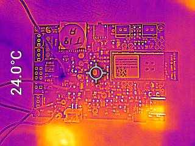
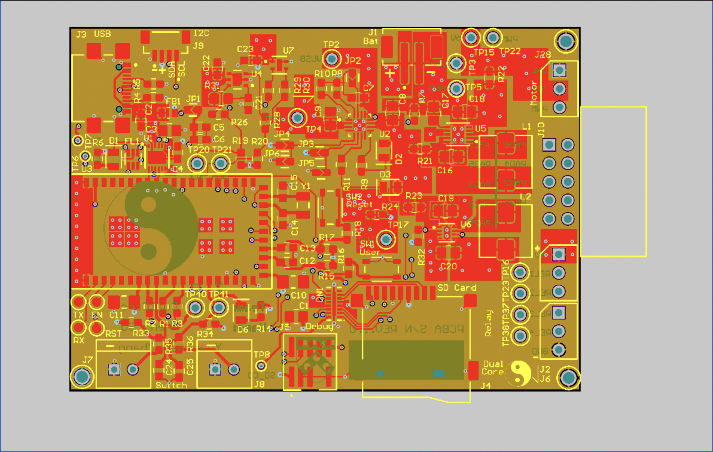
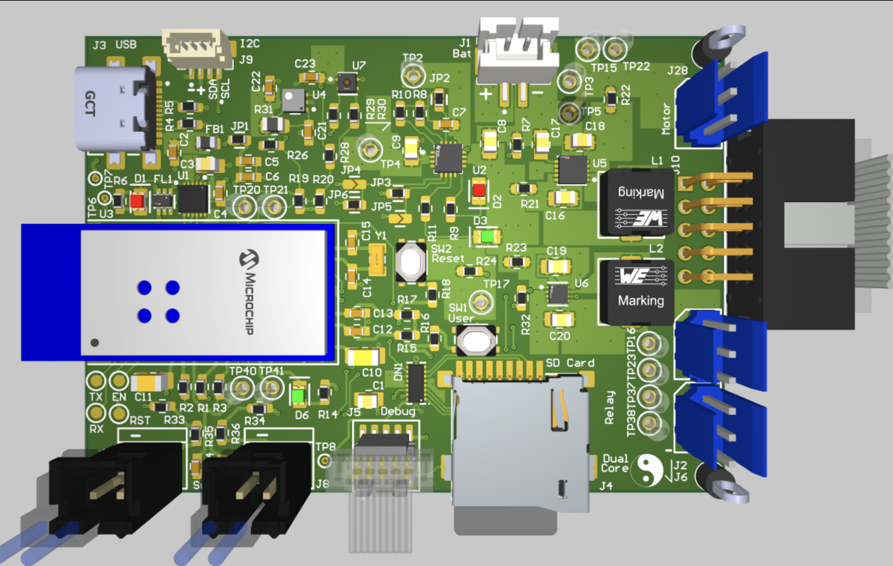

# a14g-final-submission

    * Team Number: 18
    * Team Name: DualCore
    * Team Members: Peng Su, Yuanchao Zhang
    * Github Repository URL: https://github.com/ese5160/a14g-final-submission-s25-t18-dualcore
    * Description of test hardware: (1) Apple M3 Pro, macOS Sonoma (2) Apple M1 Pro - MacBook (development boards, sensors, actuators, laptop + OS, etc) 

## 1. Video Presentation

## 2. Project Summary

### Device Description

This smart window system integrates three user settings: gesture-based physical control (customized), autonomous environmental response (automatic), and remote management via Node-RED UI. Real-time outdoor weather data retrieved from a public API is displayed through PDLC film directly attached to the window. The system reacts dynamically to changes in indoor temperature, humidity, and air quality and simultaneously transfers this indoor data to Node-RED for remote monitoring.

- **Inspiration & Problem Solution:**

In an era of smart devices and automation, why haven’t our windows learned to take care of themselves? This project began with that simple yet overlooked question, reflecting the frustration of users who are either too busy or too far away to manually manage their windows. While many smart home solutions focus on lighting or HVAC, intelligent window systems remain relatively rare. Our system addresses this gap by combining gesture control, automated environmental response, and remote access via Node-RED—empowering users to maintain a comfortable and safe indoor environment whether they're home, at work, or asleep.

- **Internet-Augmented functionality:**

To enhance its intelligence and connectivity, our system uses the Internet in two main ways: it pulls real-time outdoor weather data from a public API to be shown on the PDLC film, and it uploads live indoor environmental data to the Node-RED dashboard, enabling users to remotely monitor and control their environment in real time. Additionally, the Node-RED interface provides four remote UI buttons that allow users to open or close the window, stop the current motion, or resume the previous control status, ensuring the window continues from where it left off before the stop command.

### Device Functionality

Our Internet-connected smart window system integrates sensors, actuators, and mechanical elements to achieve IoT functionality:

- **Sensors:**

SHTC3 (I²C-based): Temperature and humidity sensor. It provides real-time environmental data used to determine whether the window should be opened or closed automatically and also updates the Node-RED dashboard for remote user awareness.

SGP40 (I²C-based): VOC (air quality) sensor. When indoor air quality drops (e.g., smoke or poor ventilation), this sensor triggers the system to open the window for immediate ventilation.

APDS-9960 (I²C-based): Gesture sensor for physical user input. It allows the user to switch between control modes or manually operate the window without needing a mobile interface.

Switch Reed: Magnetic contact sensor used to detect when the window is fully closed and signals the servo to stop rotation, ensuring precise and safe positioning.

- **Actuators:**

FS5103R Continuous Rotation Servo: Controls window movement using continuous 360-degree rotation. It operates based on pulse width modulation (PWM), allowing clockwise rotation (700–1500 µs), counter-clockwise rotation (1500–2300 µs), and stops at the neutral 1500 µs signal. This flexibility enables precise directional control for opening and closing the window.

4-Channel Relay Module: Switches high-voltage PDLC segments.

PDLC Film: Acts as both a visual output and a controllable display surface.

- **Other Critical Components:**

Moving Wheel Assembly: Facilitates smooth and stable horizontal sliding of the window, reducing friction and supporting accurate movement during actuation.

Customized Servo Gear: Mechanically interlocks with a linear gear strip mounted along the top edge of the window, converting the servo’s rotational motion into linear sliding motion for precise control.

### Challenges & Solutions

One of the most memorable challenges we faced was designing a **flexible and intelligent way for users to control the window’s opening and closing.** While we initially implemented four Node-RED UI buttons for remote operation, we quickly discovered limitations, both in real-world edge cases and during testing. For instance, when the **Internet connection is lost,** users cannot rely on the UI, leaving manual hand-movement as the only fallback, which compromises the system’s intelligence. Even when the network connection is stable, we observed that our **multiple WiFi Tasks could become unresponsive or slow to react,** especially when handling transitions between **different servo operations** that depend on carefully tuned PWM signals. These delays occasionally prevented timely command execution from the Node-RED interface, resulting in **inconsistent control.** Moreover, relying solely on button presses **lacked novelty** and didn’t align with the intuitive, physical habit of sliding windows by hand, prompting us to **explore a more natural, responsive solution:**

To overcome this, **Peng Su** proposed a pivotal enhancement: integrating the **APDS-9960 gesture sensor** into our final design. This was not part of our original plan, but it turned out to be a **game-changing addition:** With carefully developed firmware, we enabled **intuitive left and right-hand gestures to control window movement in real time.** This solution not only restored **control in offline scenarios** but also provided a **more natural and engaging user experience,** striking the ideal balance between technological innovation and familiar daily habits.

### Prototype Learnings

### Next Steps & Takeaways

### Project Links

- [Node-RED UI Link](http://172.190.44.195:1880/ui/#!/2)

- [Altium 365 PCBA Link](https://upenn-eselabs.365.altium.com/designs/74F5107D-5401-45F2-BDF6-51E560E29148#design)

## 3. Hardware & Software Requirements

## Hardware Requirements Specification (HRS)

### HRS 01 – Microcontroller & PCB
- The system shall use a SAM W25-based custom PCB with I/O for sensors, actuators, and communication interfaces (I²C, UART, SPI).
- The PCB shall provide Wi-Fi connectivity and headers for external modules.

✅ **We have shown the integration of custom PCBA in Part 4: Project Photos & Screenshots.**

### HRS 02 – Sensors
- The system shall include:
  - **SHTC3** to measure indoor temperature and humidity.
  - **SGP40** to detect VOCs and air quality issues.
  - **APDS-9960** to enable gesture-based control.
  - **Switch Reed** to detect full window closure and signal the servo to stop.

✅ **We have shown the integration of all Sensors with our custom PCBA in Part 4: Project Photos & Screenshots.**

### HRS 03 – Window Actuator
- The system shall use an FS5103R continuous rotation servo:
  - PWM-based control: CW (700–1500 µs), CCW (1500–2300 µs), Stop (1500 µs).
  - Shall be mechanically coupled using a custom gear and linear gear strip.

✅ **We have shown the integration of the Actuator with our custom PCBA, gear, and linear gear strip in Part 4: Project Photos & Screenshots.**

### HRS 04 – PDLC Film Control

- The system shall use a step-up and DC-to-AC converter to drive PDLC film, with a 4-channel Relay switching AC power to each segment for individual control.
- Each segment shall be individually controllable to display weather data.
- High-voltage lines shall be safely isolated and protected.

✅ **We have shown the integration of the PDLC Film (Sunny, Cloudy, Overcast, Rainy) with our 4-channel Relay in Part 1: Video Presentation and Part 4: Project Photos & Screenshots.**

### HRS 05 – Optional Voice System
- The PCB shall support an optional speaker module via UART or I²S.

### HRS 06 – Housing & Mounting
- All components shall fit within an acrylic frame with mounting points and ventilation.
- PDLC film shall be flush-mounted on the window surface.

✅ **We have shown the integration of our "Housing" with all other parts in Part 4: Project Photos & Screenshots.**

### HRS 07 – Switch Reed Integration
- The system shall stop servo movement immediately when the Switch Reed detects full window closure.

✅ **We have shown the function of our Switch Reed in Part 1: Video Presentation.**

### HRS 09 – Roller Mechanism
– The window shall use two dual-wheel assemblies to ensure smooth and consistent sliding.

✅ **We have shown the integration of our bottom window with two brass flat-edge dual-rollers in Part 1: Video Presentation and Part 4: Project Photos & Screenshots.**

---

## Software Requirements Specification (SRS)

### SRS 01 – Real-Time Monitoring
- The system shall collect and transmit temperature, humidity, and air quality data to a Node-RED dashboard via Wi-Fi.

### SRS 02 – Node-RED Remote Control
- The system shall provide four remote control buttons via Node-RED:
  - Open Window  
  - Close Window  
  - Stop Motion  
  - Resume Previous Status

✅ **We have shown all four remote window control operations in Part 1: Video Presentation.**

### SRS 03 – Gesture-Based Control
- The system shall support gesture commands via the APDS-9960 sensor:
  - Vertical swipe: Switch control mode
  - Left swipe: Open window  
  - Right swipe: Close window  

✅ **We have shown all three window control operations via gestures in Part 1: Video Presentation.**

### SRS 04 – Intelligent Automation
- The system shall use an algorithm that considers temperature, humidity, and air quality together to make smart window control decisions.
- The logic shall prevent conflicting actions (e.g., opening during rain despite poor air quality).

✅ **We have shown all automatic window control operations based on change of conditions in Part 1: Video Presentation.**

### SRS 05 – Redundant Motion Prevention
- The system shall not re-open if the window is already fully open, nor re-close if already fully closed.

✅ **We have shown that our switch reeds stop the servo as the window is fully open or closed in Part 1: Video Presentation.**

### SRS 06 – PDLC Weather Display with Override
- The system shall display real-time weather data on the PDLC film using API input.
– The system shall allow users to remotely schedule PDLC on/off times via Node-RED
- Manual override commands shall take precedence over scheduled updates.

✅ **We have shown that our PDLC Film is properly turned on/off and displays real-time weather data from the API in Part 1: Video Presentation.**

## 4. Project Photos & Screenshots

- **Photos of Final Project:**

- **The Standalone PCBA, TOP:**

- **The Standalone PCBA, BOTTOM:**

- **Thermal camera images while the board is running under load 120% (936mA):**

- **The Altium Board design in 2D view (screenshot):**

- **The Altium Board design in 3D view (screenshot):**

- **Node-RED dashboard (screenshot):**

- **Node-RED backend (screenshot):**
  
- **Block diagram of your system:**
  
## Codebase

- A link to your final embedded C firmware codebases
- A link to your Node-RED dashboard code
- Links to any other software required for the functionality of your device

