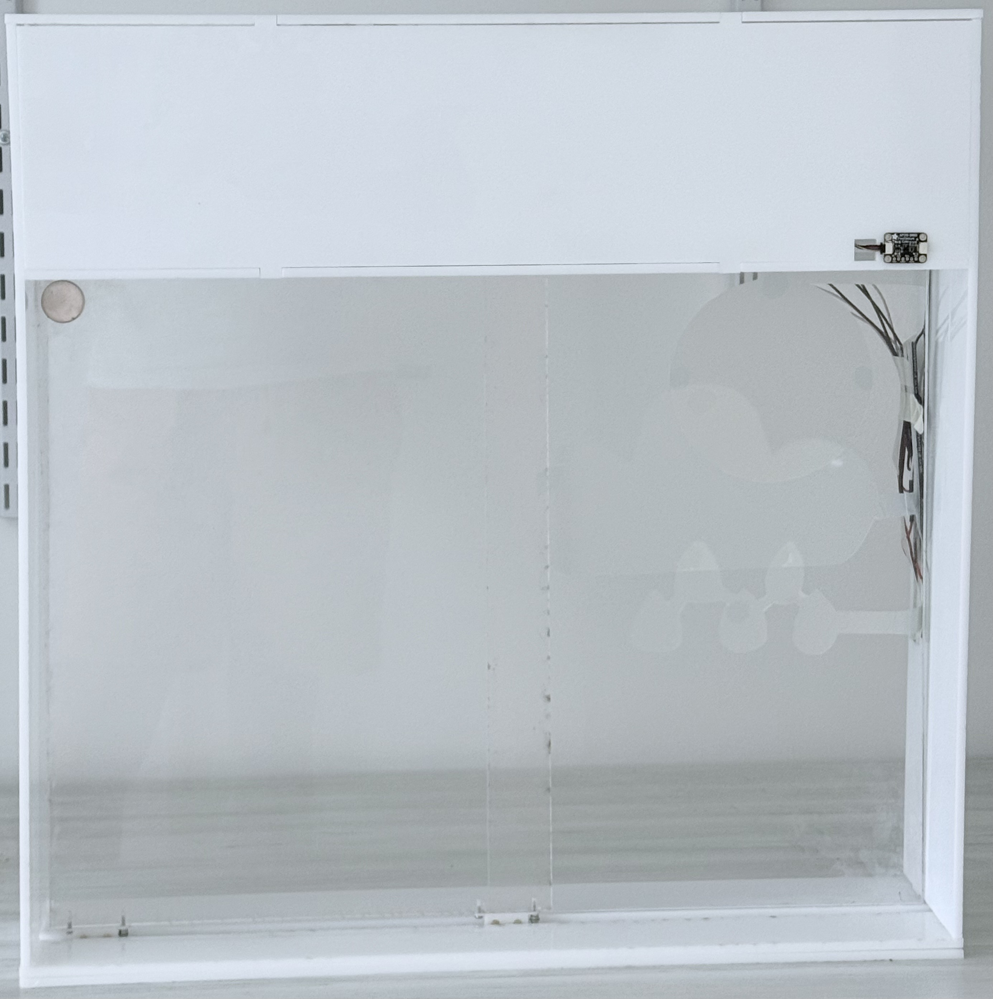
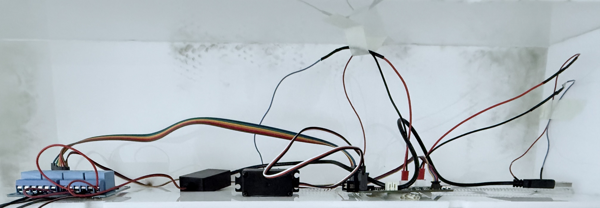
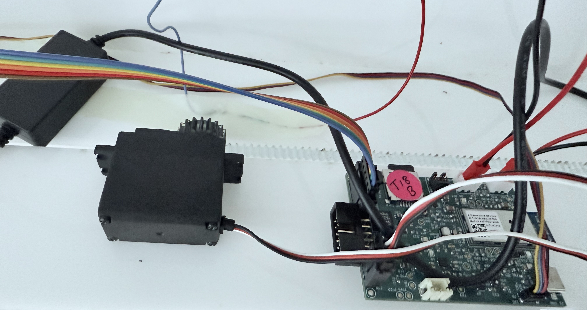
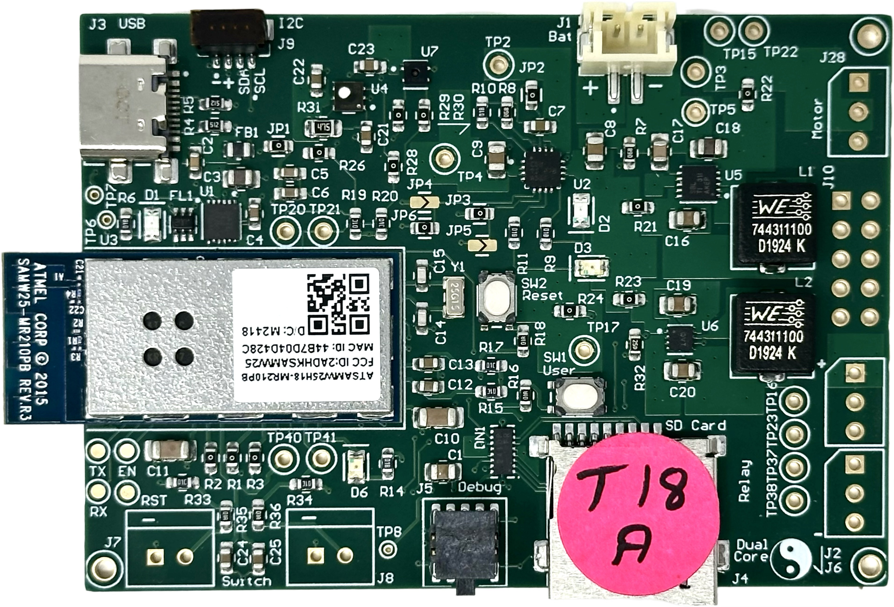
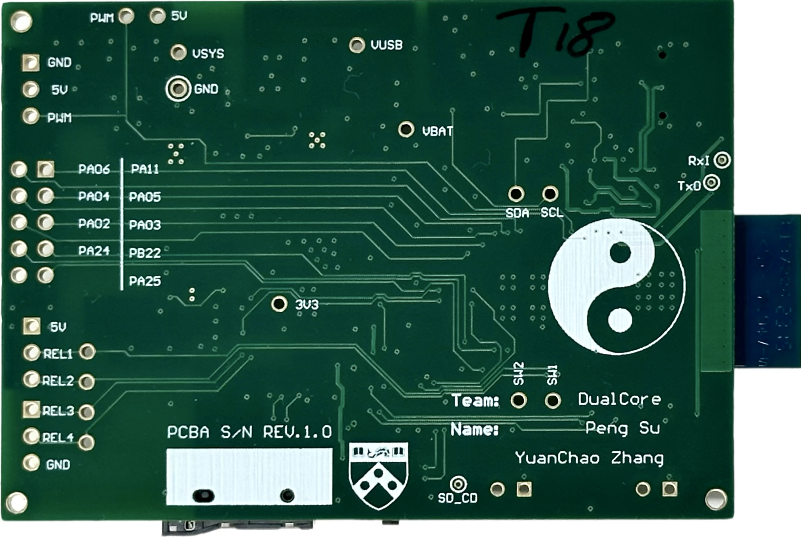
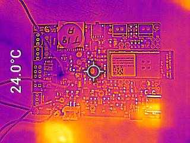
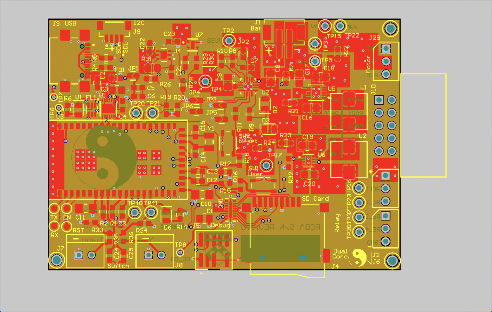
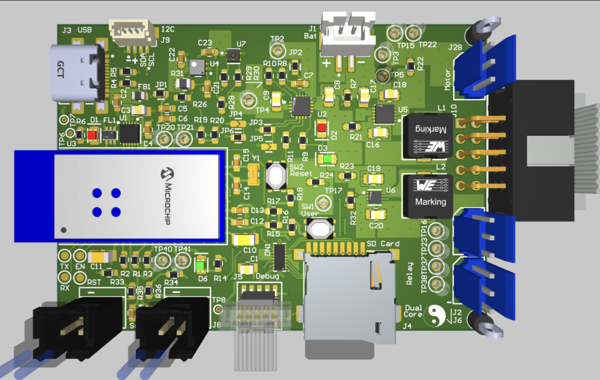
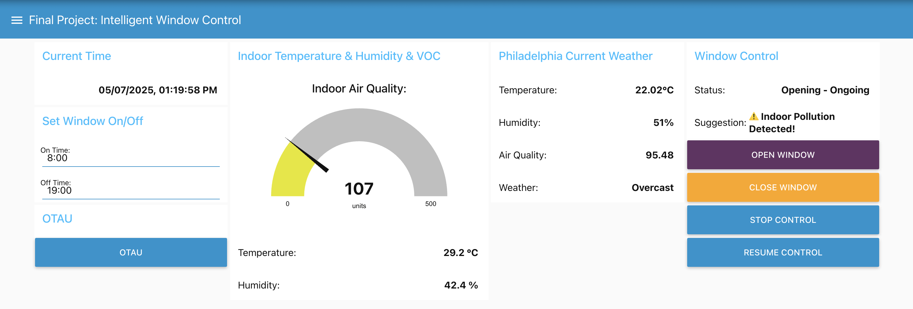
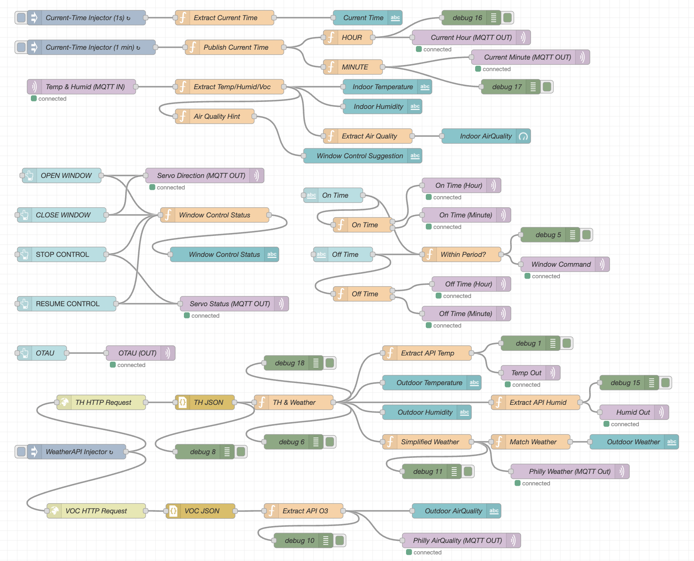

# a14g-final-submission

    * Team Number: 18
    * Team Name: DualCore
    * Team Members: Peng Su, Yuanchao Zhang
    * Github Repository URL: https://github.com/ese5160/a14g-final-submission-s25-t18-dualcore
    * GitHub Pages Website: https://ese5160.github.io/a14g-final-submission-s25-t18-dualcore/
    * Description of test hardware: (1) Custom SAM W25-based PCBA (2) Sensors: SHTC3, SGP40, APDS-9960, Switch Reed (3) Actuators: FS5103R servo, 4-Channel Relay, PDLC film (4) Apple M3 Pro + macOS Sonoma (5) HP Laptop + Windows 10

## 1. Video Presentation

[Video Presentation](https://www.youtube.com/watch?v=fN0mfGCGaM4)

## 2. Project Summary

### Device Description

This smart window system integrates three user settings: gesture-based physical control (customized), autonomous environmental response (automatic), and remote management via Node-RED UI. Real-time outdoor weather data retrieved from a public API is displayed through PDLC film directly attached to the window. The system reacts dynamically to changes in indoor temperature, humidity, and air quality and simultaneously transfers this indoor data to Node-RED for remote monitoring.

- **Inspiration & Problem Solution:**

In an era of smart devices and automation, why haven’t our windows learned to take care of themselves? This project began with that simple yet overlooked question, reflecting the frustration of users who are either too busy or too far away to manage their windows manually. While many smart home solutions focus on lighting or HVAC, intelligent window systems remain relatively rare. Our system addresses this gap by combining gesture control, automated environmental response, and remote access via Node-RED—empowering users to maintain a comfortable and safe indoor environment whether they're home, at work, or asleep.

- **Internet-Augmented functionality:**

To enhance its intelligence and connectivity, our system uses the Internet in two main ways: it pulls real-time outdoor weather data from a public API to be shown on the PDLC film, and it uploads live indoor environmental data to the Node-RED dashboard, enabling users to remotely monitor and control their environment in real time. Additionally, the Node-RED interface provides four remote UI buttons that allow users to open or close the window, stop the current motion, or resume the previous control status, ensuring the window continues from where it left off before the stop command.

### Device Functionality

Our Internet-connected smart window system integrates sensors, actuators, and mechanical elements to achieve IoT functionality:

- **Sensors:**

**SHTC3 (I²C-based): Temperature and humidity sensor.** It provides real-time environmental data used to determine whether the window should be opened or closed automatically and also updates the Node-RED dashboard for remote user awareness.

**SGP40 (I²C-based): VOC (air quality) sensor.** When indoor air quality drops (e.g., smoke or poor ventilation), this sensor triggers the system to open the window for immediate ventilation.

**APDS-9960 (I²C-based): Gesture sensor for physical user input.** It allows the user to switch between control modes or manually operate the window without needing a mobile interface.

**Switch Reed:** Magnetic contact sensor used to detect when the window is fully closed and signals the servo to stop rotation, ensuring precise and safe positioning.

- **Actuators:**

**FS5103R Continuous Rotation Servo: Controls window movement using continuous 360-degree rotation.** It operates based on pulse width modulation (PWM), allowing clockwise rotation (700–1500 µs), counter-clockwise rotation (1500–2300 µs), and stops at the neutral 1500 µs signal. This flexibility enables precise directional control for opening and closing the window.

**4-Channel Relay Module:** Switches high-voltage PDLC segments.

**PDLC Film:** Acts as both a visual output and a controllable display surface.

- **Other Critical Components:**

**Moving Wheel Assembly:** Facilitates smooth and stable horizontal sliding of the window, reducing friction and supporting accurate movement during actuation.

**Customized Servo Gear:** Mechanically interlocks with a linear gear strip mounted along the top edge of the window, converting the servo’s rotational motion into linear sliding motion for precise control.

- **System-Level Block Diagram:**

### Challenges & Solutions

One of the most memorable challenges we faced was designing a **flexible and intelligent way for users to control the window’s opening and closing.** While we initially implemented four Node-RED UI buttons for remote operation, we quickly discovered limitations, both in real-world edge cases and during testing. For instance, when the **Internet connection is lost,** users cannot rely on the UI, leaving manual hand-movement as the only fallback, which compromises the system’s intelligence. Even when the network connection is stable, we observed that our **multiple WiFi Tasks could become unresponsive or slow to react,** especially when handling transitions between **different servo operations** that depend on carefully tuned PWM signals. These delays occasionally prevented timely command execution from the Node-RED interface, resulting in **inconsistent control.** Moreover, relying solely on button presses **lacked novelty** and didn’t align with the intuitive, physical habit of sliding windows by hand, prompting us to **explore a more natural, responsive solution:**

To overcome this, **Peng Su** proposed a pivotal enhancement: integrating the **APDS-9960 gesture sensor** into our final design. This was not part of our original plan, but it turned out to be a **game-changing addition:** With carefully developed firmware, we enabled **intuitive left and right-hand gestures to control window movement in real time.** This solution not only restored **control in offline scenarios** but also provided a **more natural and engaging user experience,** striking the ideal balance between technological innovation and familiar daily habits.

Another significant challenge is that we encountered was managing multiple concurrent tasks in FreeRTOS. With several real-time operations—such as sensor sampling, servo motor actuation, gesture detection, and MQTT communication—running in parallel, we quickly learned that improper task priority assignments or insufficient stack sizes could lead to task blocking, missed notifications, or even full system hangs. For example, delays in Wi-Fi publishing sometimes caused gesture detection or motor control to stall, leading to inconsistent system responses. 

After in-depth debugging and analysis, we restructured our FreeRTOS architecture by prioritizing time-sensitive tasks like servo control and allocating appropriate stack space to each task based on its execution needs. This restructuring significantly improved system stability and responsiveness.

### Prototype Learnings

- **Increase Clearance Between Connectors with Uncertain Dimensions on Custom PCBA:**

We learned that mechanical layout decisions can significantly impact both the assembly process and long-term usability. Specifically, placing connectors with uncertain or varying physical dimensions too close together made soldering more difficult and introduced the risk of interference between components. This highlighted the importance of accounting for mechanical tolerances and cable accessibility early in the PCB design stage.

We would increase the clearance between connectors with uncertain dimensions on our custom PCBA. This adjustment would improve soldering accessibility, mechanical stability, and allow more space for cable routing during integration and testing. We would also implement 3D layout checks or physical measurements during PCB design to catch these issues before fabrication.

- **Integrate Wi-Fi Tasks with Driver Tasks Early to Ensure Consistent and Compatible System Behavior:**

Building and testing this smart window prototype taught us the importance of system-level integration early in the development process. While individual sensor and driver modules functioned well in isolation, we encountered unexpected issues when combining them, particularly with Wi-Fi tasks interacting with timing-sensitive drivers like PWM-based servo control and I²C sensors. These timing mismatches led to inconsistent behaviors and responsiveness during testing.

If we were to build this device again, we would focus on early integration of communication tasks (like Wi-Fi and MQTT) with hardware control tasks. Doing so would allow us to catch conflicts sooner and refine the FreeRTOS task structure and synchronization mechanisms before final debugging. We would also improve the gesture detection pipeline for better real-time reliability and spend more time validating environmental thresholds under real-world conditions. This iterative process reinforced that success depends not just on individual components working, but on how well they work together in a coordinated system.

### Next Steps & Takeaways

- **Next Steps to Improve Our Project:**

**Optimize Gesture Detection:** We plan to switch from polling-based gesture recognition to an interrupt-driven approach for better responsiveness and accuracy.

**Refine Sensor Thresholds:** We aim to calibrate our temperature, humidity, and VOC thresholds through controlled testing to reduce false triggers.

**Enhance Reliability of Wi-Fi Tasks:** We observed occasional delays or failures in WiFi communication and plan to implement reconnection logic and error handling to improve stability.

**Balance Simultaneous FreeRTOS Tasks:** We aim to improve task timing and prioritization across gesture sensing, servo control, sensor reading, and MQTT communication to ensure smooth and deterministic system behavior.

**Improve Power Efficiency:** We will explore low-power modes for the MCU and sensors to prepare the system for real-world deployment with minimal power usage.

**Finalize Hardware Packaging:** We intend to design a clean, functional enclosure and perform long-term tests in real home or lab environments.

- **Takeaways from ESE5160:**

**Custom PCBA Design:** We successfully customized our own PCBA in Altium Designer, iterated on schematics and layout, and verified the functionality through board bring-up and thermal testing.

**Firmware Development:** We learned to build FreeRTOS-based firmware with multitasking, semaphores, and resource synchronization.

**Sensor Integration:** We became comfortable interfacing with multiple I2C sensors and validating their data through real-time testing.

**IoT Communication:** We implemented bidirectional MQTT communication and created a user-friendly Node-RED dashboard for remote control.

**Debugging & Testing:** We practiced debugging real-time systems and handling edge cases such as task delays, sensor errors, and communication failures.

**Mechanical Integration (MCAD):** We designed and fabricated a custom mechanical window frame with a servo-driven actuation system, ensuring proper fit and alignment between the PCBA and mechanical components.

**System Integration:** We developed a complete end-to-end system that connects physical sensing, actuator control, and cloud interaction.

### Project Links

- Public URL to our **Node-RED Dashboard**: [Node-RED UI Link](http://172.190.44.195:1880/ui/#!/2)

- Public link to our final **PCBA on Altium 365**: [Altium 365 PCBA Link](https://upenn-eselabs.365.altium.com/designs/74F5107D-5401-45F2-BDF6-51E560E29148#design)

- A link to our final **embedded C firmware codebases:** https://github.com/ese5160/final-project-t18-dualcore/tree/main/Final%20Firmware%20Code
  
## 3. Hardware & Software Requirements

## Hardware Requirements Specification (HRS)

### HRS 01 – Microcontroller & PCB
- The system shall use a SAM W25-based custom PCB with I/O for sensors, actuators, and communication interfaces (I²C, UART, SPI).
- The PCB shall provide Wi-Fi connectivity and headers for external modules.

✅ **We have shown the integration of custom PCBA in Part 4: Project Photos & Screenshots.**

### HRS 02 – Sensors
- The system shall include:
  - **SHTC3** to measure indoor temperature and humidity.
  - **SGP40** to detect VOCs and air quality issues.
  - **APDS-9960** to enable gesture-based control.
  - **Switch Reed** to detect full window closure and signal the servo to stop.

✅ **We have shown the integration of all Sensors with our custom PCBA in Part 4: Project Photos & Screenshots.**

### HRS 03 – Window Actuator
- The system shall use an FS5103R continuous rotation servo:
  - PWM-based control: CW (700–1500 µs), CCW (1500–2300 µs), Stop (1500 µs).
  - Shall be mechanically coupled using a custom gear and linear gear strip.

✅ **We have shown the integration of the Actuator with our custom PCBA, gear, and linear gear strip in Part 4: Project Photos & Screenshots.**

### HRS 04 – PDLC Film Control

- The system shall use a step-up and DC-to-AC converter to drive PDLC film, with a 4-channel Relay switching AC power to each segment for individual control.
- Each segment shall be individually controllable to display weather data.
- High-voltage lines shall be safely isolated and protected.

✅ **We have shown the integration of the PDLC Film (Sunny, Cloudy, Overcast, Rainy) with our 4-channel Relay in Part 1: Video Presentation and Part 4: Project Photos & Screenshots.**

### HRS 05 – Optional Voice System
- The PCB shall support an optional speaker module via UART or I²S.

### HRS 06 – Housing & Mounting
- All components shall fit within an acrylic frame with mounting points and ventilation.
- PDLC film shall be flush-mounted on the window surface.

✅ **We have shown the integration of our "Housing" with all other parts in Part 4: Project Photos & Screenshots.**

### HRS 07 – Switch Reed Integration
- The system shall stop servo movement immediately when the Switch Reed detects full window closure.

✅ **We have shown the function of our Switch Reed in Part 1: Video Presentation.**

### HRS 09 – Roller Mechanism
– The window shall use two dual-wheel assemblies to ensure smooth and consistent sliding.

✅ **We have shown the integration of our bottom window with two brass flat-edge dual-rollers in Part 1: Video Presentation and Part 4: Project Photos & Screenshots.**

---

## Software Requirements Specification (SRS)

### SRS 01 – Real-Time Monitoring
- The system shall collect and transmit temperature, humidity, and air quality data to a Node-RED dashboard via Wi-Fi.

✅ **We compared our system’s temperature and humidity readings with those from the apartment’s air conditioning system. The temperature measurements showed a deviation of approximately ±1.5 °C, while humidity differed by about ±2.3%. For VOC, although we do not have an external reference to directly verify its accuracy, we confirmed that the readings remain around 100 in a typical indoor environment, which is consistent with the expected range described in the SGP40 datasheet.**

**However, these small discrepancies do not hinder the system’s effectiveness, as our design emphasizes detecting dynamic environmental trends rather than relying on absolute precision. This sensitivity to environmental change ensures reliable activation of window control actions in response to conditions such as rising temperature, humidity, or VOC levels.**

### SRS 02 – Node-RED Remote Control
- The system shall provide four remote control buttons via Node-RED:
  - Open Window  
  - Close Window  
  - Stop Motion  
  - Resume Previous Status

✅ **We have shown all four remote window control operations in Part 1: Video Presentation.**

### SRS 03 – Gesture-Based Control
- The system shall support gesture commands via the APDS-9960 sensor:
  - Vertical Swipe: Switch Control Mode (UP: Custom Mode, DOWN: Automated Mode)
  - Left Swipe (Custom Mode): Open Window  
  - Right Swipe (Custom Mode): Close Window  

✅ **We have shown all three window control operations via gestures in Part 1: Video Presentation.**

### SRS 04 – Intelligent Automation
- The system shall use an algorithm that considers temperature, humidity, and air quality together to make smart window control decisions.
- The logic shall prevent conflicting actions (e.g., opening during rain despite poor air quality).

✅ **We have shown all automatic window control operations based on change of conditions in Part 1: Video Presentation.**

### SRS 05 – Redundant Motion Prevention
- The system shall not re-open if the window is already fully open, nor re-close if already fully closed.

✅ **We have shown that our switch reeds stop the servo as the window is fully open or closed in Part 1: Video Presentation.**

### SRS 06 – PDLC Weather Display with Override
- The system shall display real-time weather data on the PDLC film using API input.
– The system shall allow users to remotely schedule PDLC on/off times via Node-RED
- Manual override commands shall take precedence over scheduled updates.

✅ **We have shown that our PDLC Film is properly turned on/off and displays real-time weather data from the API in Part 1: Video Presentation.**

## 4. Project Photos & Screenshots

- **Photos of Final Project:**

- **The Standalone PCBA, TOP:**

- **The Standalone PCBA, BOTTOM:**

- **Thermal camera images while the board is running under load 120% (936mA):**

- **The Altium Board design in 2D view (screenshot):**

- **The Altium Board design in 3D view (screenshot):**

- **Node-RED dashboard (screenshot):**

- **Node-RED backend (screenshot):**

- **Block diagram of your system:**

## Codebase

- A link to our final **embedded C firmware codebases:** https://github.com/ese5160/final-project-t18-dualcore/tree/main/Final%20Firmware%20Code
  
- A link to our **Node-RED dashboard code:** https://github.com/ese5160/final-project-t18-dualcore/blob/main/Node-RED/Final_Project.json

